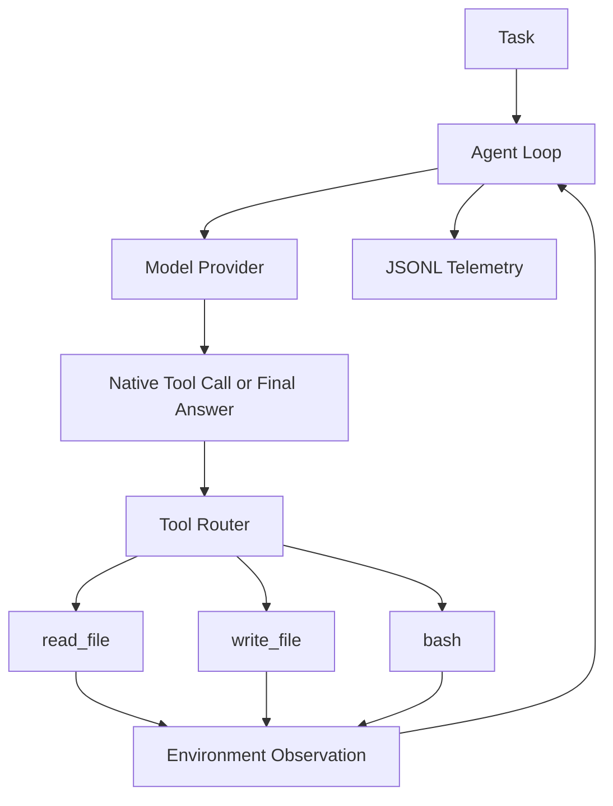
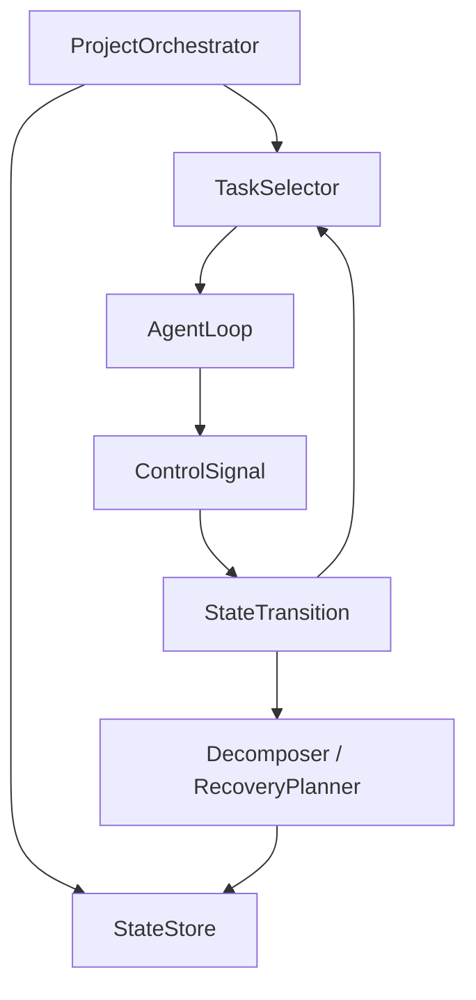
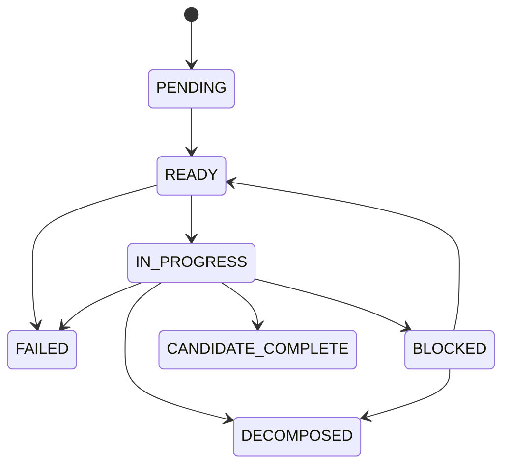
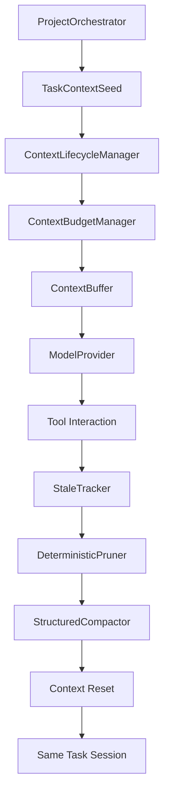

# longrun-agent

`longrun-agent` is a minimal Coding Agent Runtime for the Baseline Agent Runtime v0.1 stage. It validates the core loop:

```text
model decision -> tool call -> environment execution -> observation -> next model call
```

It intentionally does not implement task planning, memory, skills, reflection, handoff, context compaction, verification gates, multi-agent workflows, SWE-bench integration, training, fine-tuning, databases, web services, or any heavyweight agent framework.

## Architecture



## Current Scope

- OpenAI-compatible provider using native tool calling.
- Fake provider for deterministic tests and demos.
- Structured protocol: `ToolCall`, `FinalAnswer`, `ToolResult`, `ModelResponse`, `RunResult`.
- Workspace-restricted `read_file`, `write_file`, and `bash`.
- JSONL telemetry under `.runs/<run_id>/`.
- CLI entry points for running the agent and listing tools.
- A toy calculator repository that the fake provider can repair.
- v0.2 project orchestration with external task state, coarse planning, deterministic task selection, as-needed decomposition, bounded recovery candidate selection, and resume.

## v0.2 State-Grounded Adaptive Planning

v0.2 adds a deterministic orchestration layer around the v0.1 Agent Loop. It studies external state and planning only; it still does not add memory, skills, context compaction, verification gates, handoff, or multi-agent execution.

Project / Task / Session:

- `Project`: the full user objective.
- `Task`: one independently actionable subgoal in the external project plan.
- `Session`: one `AgentLoop.run()` invocation for one active task.

`RunStatus.COMPLETED` only means the model ended a session. A task becomes `CANDIDATE_COMPLETE` only when the session calls `request_task_completion`. `CANDIDATE_COMPLETE` is not `VERIFIED`; future work will add a verification gate.
If bounded recovery selects `retry_with_guidance`, the current session ends, the guidance is recorded in task progress notes, and the task returns to `READY` so the next session prompt includes that guidance.
Project Sessions stop immediately after a successful terminal control signal. In Project mode, a plain `FinalAnswer` is treated as a protocol problem and the loop asks for `request_task_completion`, `report_blocker`, or `request_decomposition`; it is not converted into task completion.



Task state machine:



Initial Planning uses native tool calling with `submit_plan`. Plans are coarse-grained, use explicit dependencies, and start with `PENDING` tasks. As-Needed Decomposition runs only after a blocker or failed progress signal requires it. Bounded Planning Search is a depth-1 generate/evaluate/select step for recovery candidates; it is not full Tree-of-Thought BFS/DFS and does not copy or execute repository branches.

Planning modes:

- `disabled`: v0.1 behavior.
- `static`: initial plan, no failure decomposition.
- `adaptive`: initial plan plus decomposition when needed.
- `adaptive_search`: adaptive mode plus bounded recovery candidates.

## Install

```bash
python -m pip install -e ".[dev]"
```

## Configure

`.env.example` documents variable names only. The program does not automatically load `.env` files. Copying `.env.example` has no effect unless you manually source/export those variables in your shell.

For WSL2/Linux:

```bash
export OPENAI_API_KEY="your-key"
export MODEL_NAME="your-model"
export OPENAI_BASE_URL="https://your-compatible-endpoint/v1"
```

For PowerShell:

```powershell
$env:OPENAI_API_KEY="your-key"
$env:MODEL_NAME="your-model"
$env:OPENAI_BASE_URL="https://your-compatible-endpoint/v1"
```

`configs/baseline.yaml` uses the real OpenAI-compatible provider. `configs/fake.yaml` uses the deterministic fake provider and does not require an API key.

## Fake Provider Demo

```bash
longrun-agent run --config configs/fake.yaml --fake-provider --task "Fix the implementation bug in calculator.py so that all tests pass."
```

The scripted fake provider runs this trace:

```text
read_file("calculator.py")
write_file("calculator.py", fixed implementation)
bash("python -m pytest -q")
FinalAnswer
```

## Real API Demo

```bash
longrun-agent run --config configs/baseline.yaml --task "Fix the implementation bug in calculator.py so that all tests pass."
```

The runtime reads the API key only from the configured environment variable and does not write it to logs.

## Project CLI

Start a planned project:

```bash
longrun-agent project start \
  --config configs/planning_static.yaml \
  --task "Implement the requested multi-step repository changes." \
  --scripted-responses examples/task_service_repo/scripted_project_static_realwork.json
```

Start from a task file:

```bash
longrun-agent project start --config configs/planning_adaptive.yaml --task-file examples/task_service_repo/TASK.md
```

Resume:

```bash
longrun-agent project resume --config configs/planning_adaptive.yaml --project-id <project-id>
```

Inspect state:

```bash
longrun-agent project status --config configs/planning_adaptive.yaml --project-id <project-id>
longrun-agent project tree --config configs/planning_adaptive.yaml --project-id <project-id>
longrun-agent project metrics --config configs/planning_adaptive.yaml --project-id <project-id>
```

State files are stored under `.runs/projects/<project_id>/`:

```text
project_state.json
project_events.jsonl
sessions.jsonl
project_metrics.json
plan_revisions/
```

Each session row records project/task/session IDs, run ID, attempt number, run status, start/finish time, duration, steps, tool call count, token count, terminal signal, and files touched. `project_metrics.json` is derived from `sessions.jsonl` and project state; `sessions_without_terminal_signal` is not hard-coded.
Project metrics also report wall-clock seconds, configured project budget, time-budget exhaustion, failed tasks, no-progress sessions, repeated tool calls, changed-file count, successful test commands, and final verification status.

Plan revisions are stored both in `project_state.json` and as individual JSON files under `plan_revisions/<revision_id>.json`.
When all leaf tasks are `candidate_complete`, the harness runs `planning.execution.final_verification_command` directly in the workspace and writes `final_verification.txt`. The project becomes `candidate_complete` only if this command exits with code 0. Set the command to an empty list only for tests that need the earlier planning-only behavior.

Deterministic project E2E scripts:

```bash
python examples/task_service_repo/reset_repo.py
longrun-agent project start --config configs/planning_static.yaml --task-file examples/task_service_repo/TASK.md --scripted-responses examples/task_service_repo/scripted_project_static_realwork.json

python examples/task_service_repo/reset_repo.py
longrun-agent project start --config configs/planning_adaptive.yaml --task-file examples/task_service_repo/TASK.md --scripted-responses examples/task_service_repo/scripted_project_adaptive.json

python examples/task_service_repo/reset_repo.py
longrun-agent project start --config configs/planning_adaptive_search.yaml --task-file examples/task_service_repo/TASK.md --scripted-responses examples/task_service_repo/scripted_project_adaptive_search.json
```

Independent validation:

```bash
python scripts/validate_task_service_result.py --repo examples/task_service_repo
python scripts/validate_project_run.py --project-dir .runs/projects/<project-id> --mode static
```

Experiment comparison:

- A. v0.1 Naive Agent
- B. Static Planning
- C. Adaptive Decomposition
- D. Adaptive Decomposition + Bounded Planning Search

The state layer reports statistics for candidate completed tasks, blocked tasks, decomposition count, max task depth, plan revisions, recovery candidates, sessions without terminal signal, project sessions, tool calls, tokens, and duration.

Real provider planning templates are available as `configs/planning_static_real.yaml`, `configs/planning_adaptive_real.yaml`, and `configs/planning_adaptive_search_real.yaml`. They use `${MODEL_NAME}`, `${OPENAI_BASE_URL}`, and `OPENAI_API_KEY`; no real key is stored in the repository.

For GLM 4.7 Flash static planning with a bounded run budget:

```bash
longrun-agent project start \
  --config configs/planning_static_glm47_10min.yaml \
  --task-file examples/task_service_repo/TASK.md
```

This configuration uses `max_project_seconds=540`, `max_session_seconds=150`, `max_project_sessions=6`, `max_sessions_per_task=2`, and final pytest verification. It is designed to stop clearly with `failed` or `time_limit_reached` rather than claiming false completion when the model or API cannot finish in time.

For a more stable 30-minute GLM 4.7 Flash evaluation:

```bash
longrun-agent project start \
  --config configs/planning_static_glm47_30min.yaml \
  --task-file examples/task_service_repo/TASK.md
```

This mode loads `examples/task_service_repo/plan_glm47_fast.json` instead of asking the model to create the initial plan. The fixed four-task plan reduces prompt churn, makes dependencies reproducible, and keeps each task focused on a small file set. Four atomic tasks are preferable for this repository because model validation, persistence/retry, CLI lookup, and integration verification touch different files and have different test evidence.

Project Session controls for the GLM configuration:

- repeated identical tool calls are suppressed;
- three consecutive read-only successful tool calls inject an `action_required` message;
- Project tool output returned to the model is capped while full artifacts remain on disk;
- file-plan resume never regenerates or reloads the plan once state exists.

## v0.3 Evidence-Aware Budgeted Context Lifecycle

v0.3 studies effective context rather than long-term memory. Maximum context is the provider window; effective context is the smaller, current, high-signal state the model can reliably use. The implementation accounts for Lost in the Middle position effects and provides lightweight RULER-style probes for constraint recall, multi-constraint retrieval, state tracking, and evidence aggregation.

Runtime boundaries:

- `Project`: full objective.
- `Task`: independently actionable subgoal.
- `Session`: one orchestrated AgentLoop attempt.
- `Context Segment`: one continuous model-input lifecycle inside the same session.
- `Step`: one model request and its tool interactions.

Context reset is not a new task session. It does not increment task attempts, project session count, task session IDs, decomposition counters, or no-progress counters. It only increments context segment/reset counters and rebuilds input from ProjectState plus the latest task-local structured handoff.



Context modes:

- `full_history`: keep accumulated history with token telemetry and hard-stop safety.
- `recent_window`: keep pinned task context plus recent complete interaction turns.
- `deterministic_prune`: compact stale, superseded, and old observations without LLM calls.
- `structured_reset`: deterministic pruning plus task-local structured handoff and same-session reset.

Context artifacts:

```text
.runs/projects/<project_id>/context/
  segments.jsonl
  context_events.jsonl
  handoffs/<handoff_id>.json
```

Context CLI:

```bash
longrun-agent context inspect --config configs/context_structured_reset.yaml --project-id <project-id> --session-id <session-id>
longrun-agent context handoff --config configs/context_structured_reset.yaml --project-id <project-id> --handoff-id <handoff-id>
```

Probe CLI:

```bash
longrun-agent eval context \
  --config evals/context_lifecycle/config.yaml \
  --probe all \
  --lengths 2048 \
  --samples 3 \
  --seed 42 \
  --dry-run

longrun-agent eval context \
  --config evals/context_lifecycle/config.yaml \
  --probe position \
  --lengths 2048,4096,8192 \
  --samples 20 \
  --seed 42 \
  --modes full_history,recent_window,deterministic_prune,structured_reset \
  --output-dir .runs/context_evals/position_main
```

The context eval harness generates one base case and replays it under every requested mode, so comparisons are paired by `case_id`. Case IDs include probe, length, sample index, and seed. The four probe families are: Lost-in-the-Middle position constraint recall, RULER-style multi-constraint retrieval, state tracking over read/write/bash chains, and evidence aggregation over stale/current test results.

Probe outputs are written to `cases.jsonl`, `predictions.jsonl`, `results.jsonl`, `summary.json`, and `summary.csv`. The model must answer through the probe-specific native tool call; provider errors and protocol errors count as failures and are not skipped.

Before a real experiment, run the preflight checks:

```bash
bash scripts/context_preflight.sh
python evals/context_lifecycle/activation_check.py --predictions .runs/context_evals/preflight_activation/predictions.jsonl
```

Ablation configs:

```bash
longrun-agent project start --config configs/context_full_history.yaml --task-file examples/task_service_repo/TASK.md
longrun-agent project start --config configs/context_recent_window.yaml --task-file examples/task_service_repo/TASK.md
longrun-agent project start --config configs/context_deterministic_prune.yaml --task-file examples/task_service_repo/TASK.md
longrun-agent project start --config configs/context_structured_reset.yaml --task-file examples/task_service_repo/TASK.md
```

Structured handoff is task-local context recovery. It is not memory, skill learning, vector retrieval, Reflexion, or cross-project recall.

## Tools

List registered tools and schemas:

```bash
longrun-agent tools --config configs/fake.yaml
```

## Toy Repository

The toy repo is in `examples/toy_repo`. It starts with a failing `divide` implementation:

```bash
cd examples/toy_repo
python -m pytest -q
```

Reset it after a demo:

```bash
git restore examples/toy_repo/calculator.py
```

```powershell
.\examples\toy_repo\reset_toy_repo.ps1
```

## Telemetry

Each run creates:

```text
.runs/<run_id>/
├── events.jsonl
├── run.json
├── prompts/
├── tool_outputs/
└── diffs/
```

Every JSONL line is a standalone event with step, event type, model name, action type, tool call id, success flag, summary, token counts, exit code, artifact path, and error fields where applicable.

## Safety Limits

- All file paths are resolved through `Path.resolve()` and checked against the workspace root with `os.path.commonpath`.
- Empty paths, parent traversal, absolute paths outside the workspace, and symlink escapes are rejected.
- `bash` runs with a fixed workspace cwd, captures stdout/stderr, applies timeouts, and saves full output artifacts.
- Obvious destructive commands such as `rm -rf /`, `shutdown`, `reboot`, `mkfs`, and destructive absolute-path operations are rejected.
- Non-zero command exit codes are environment observations, not provider failures.

## Tests

```bash
pytest -q
pytest --cov=longrun_agent --cov-report=term-missing
python -m compileall -q src tests scripts
ruff check .
ruff format --check .
git diff --check
```

## Known Limits

- The bash safety layer is minimal and is not a container sandbox.
- Windows native execution is supported for tests, but Linux/WSL2 is the preferred target.
- The runtime does not treat a plain final answer as project task completion.
- `write_file` is whole-file only; patch/edit tools are intentionally out of scope.
- v0.2 candidate completion is planning-level only and is not externally verified.
- v0.3 context compaction is conservative and task-local.
- v0.3 context probes evaluate the context harness only; they are not a full RULER benchmark and do not evaluate the whole Coding Agent.
- Bounded planning search evaluates one level of recovery candidates; it is not full ToT search.

## Next Stage

The next topic should be Verification or Memory. Memory, skills, vector retrieval, and multi-agent orchestration remain deliberately excluded from v0.3.
