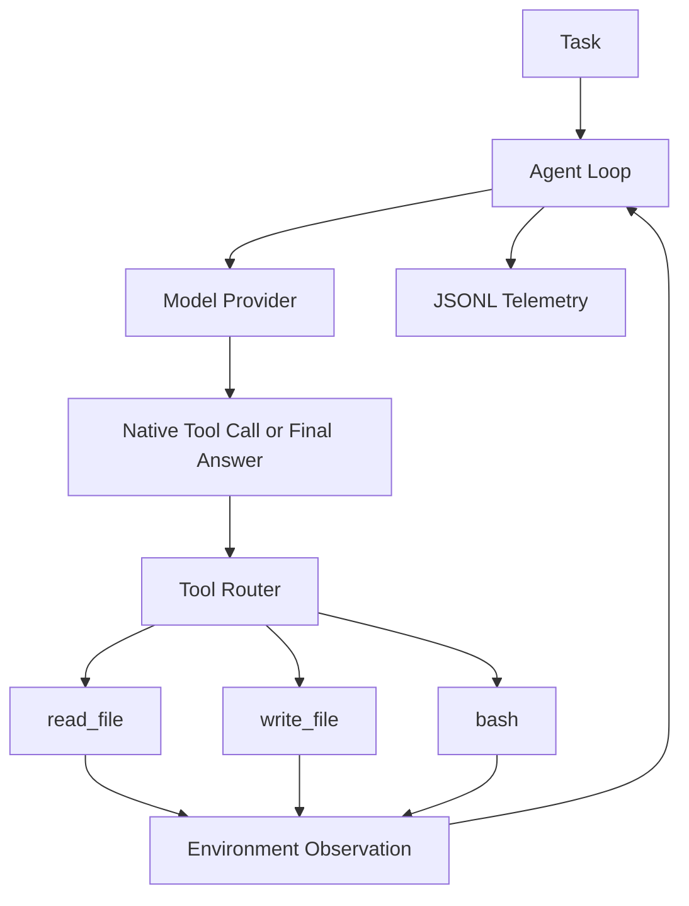

# longrun-agent

`longrun-agent` is a minimal Coding Agent Runtime for the Baseline Agent Runtime v0.1 stage. It validates the core loop:

```text
model decision -> tool call -> environment execution -> observation -> next model call
```

It intentionally does not implement task planning, memory, skills, reflection, handoff, context compaction, verification gates, multi-agent workflows, SWE-bench integration, training, fine-tuning, databases, web services, or any heavyweight agent framework.

## Architecture



## Current Scope

- OpenAI-compatible provider using native tool calling.
- Fake provider for deterministic tests and demos.
- Structured protocol: `ToolCall`, `FinalAnswer`, `ToolResult`, `ModelResponse`, `RunResult`.
- Workspace-restricted `read_file`, `write_file`, and `bash`.
- JSONL telemetry under `.runs/<run_id>/`.
- CLI entry points for running the agent and listing tools.
- A toy calculator repository that the fake provider can repair.

## Install

```bash
python -m pip install -e ".[dev]"
```

## Configure

Copy `.env.example` and set the API key for real model calls:

```bash
set OPENAI_API_KEY=your-key
set MODEL_NAME=your-model
set OPENAI_BASE_URL=https://your-compatible-endpoint/v1
```

`configs/baseline.yaml` uses the real OpenAI-compatible provider. `configs/fake.yaml` uses the deterministic fake provider and does not require an API key.

## Fake Provider Demo

```bash
longrun-agent run --config configs/fake.yaml --fake-provider --task "Fix the implementation bug in calculator.py so that all tests pass."
```

The scripted fake provider runs this trace:

```text
read_file("calculator.py")
write_file("calculator.py", fixed implementation)
bash("python -m pytest -q")
FinalAnswer
```

## Real API Demo

```bash
longrun-agent run --config configs/baseline.yaml --task "Fix the implementation bug in calculator.py so that all tests pass."
```

The runtime reads the API key only from the configured environment variable and does not write it to logs.

## Tools

List registered tools and schemas:

```bash
longrun-agent tools --config configs/fake.yaml
```

## Toy Repository

The toy repo is in `examples/toy_repo`. It starts with a failing `divide` implementation:

```bash
cd examples/toy_repo
python -m pytest -q
```

Reset it after a demo:

```powershell
.\examples\toy_repo\reset_toy_repo.ps1
```

## Telemetry

Each run creates:

```text
.runs/<run_id>/
├── events.jsonl
├── run.json
├── prompts/
├── tool_outputs/
└── diffs/
```

Every JSONL line is a standalone event with step, event type, model name, action type, tool call id, success flag, summary, token counts, exit code, artifact path, and error fields where applicable.

## Safety Limits

- All file paths are resolved through `Path.resolve()` and checked against the workspace root with `os.path.commonpath`.
- Empty paths, parent traversal, absolute paths outside the workspace, and symlink escapes are rejected.
- `bash` runs with a fixed workspace cwd, captures stdout/stderr, applies timeouts, and saves full output artifacts.
- Obvious destructive commands such as `rm -rf /`, `shutdown`, `reboot`, `mkfs`, and destructive absolute-path operations are rejected.
- Non-zero command exit codes are environment observations, not provider failures.

## Tests

```bash
pytest -q
pytest --cov=longrun_agent --cov-report=term-missing
python -m compileall src
ruff check .
ruff format --check .
```

## Known Limits

- The bash safety layer is minimal and is not a container sandbox.
- Windows native execution is supported for tests, but Linux/WSL2 is the preferred target.
- The runtime does not judge whether a coding task is truly complete after final answer.
- `write_file` is whole-file only; patch/edit tools are intentionally out of scope.

## Next Stage

Later stages can add verification gates, task state, context management, memory, skills, handoff, and multi-agent orchestration. They are deliberately excluded from this baseline runtime.
