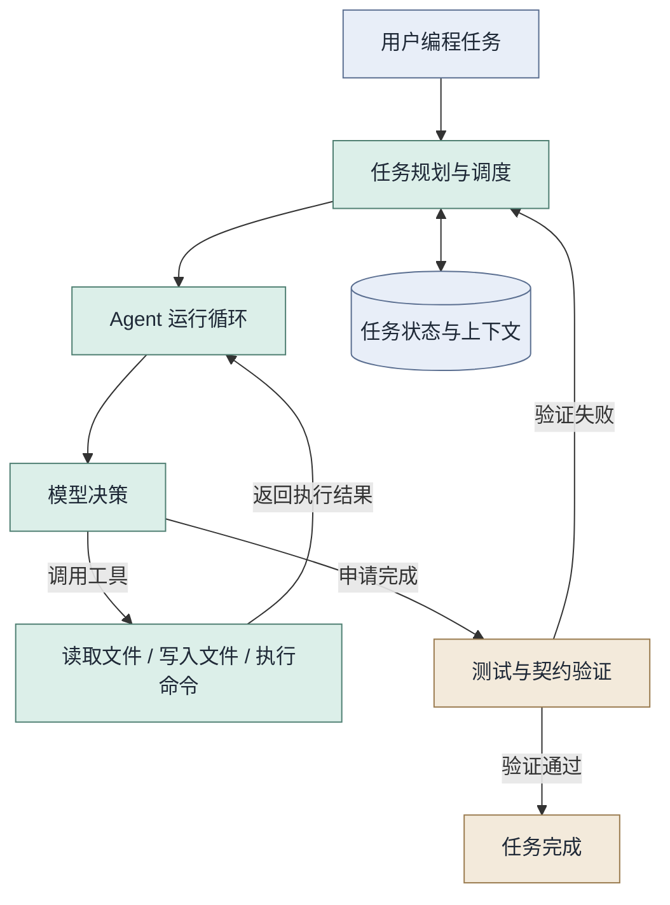

# coding-agent

`coding-agent` 是一个面向长时编程任务的本地智能体，不依赖现成的 Agent 框架。系统直接调用 OpenAI 兼容模型的原生 tool calling 接口，自行完成“模型决策—工具调用—环境反馈—继续决策”的运行闭环。

## 核心能力

- 通过 OpenAI 兼容接口与模型交互，并解析原生工具调用。
- 提供 `read_file`、`write_file` 和 `bash` 三个本地工具。
- 使用持久化任务图组织多阶段任务，支持中断后继续运行。
- 根据上下文预算进行裁剪，并在必要时生成结构化交接信息。
- 通过测试与验证契约判断任务是否真正完成，失败时重新进入处理流程。

## 架构


```mermaid
flowchart TD
    U[用户编程任务] --> P[任务规划与调度]
    P --> L[Agent 运行循环]
    L --> M[模型决策]
    M -->|调用工具| T[读取文件 / 写入文件 / 执行命令]
    T -->|返回执行结果| L
    M -->|申请完成| V[测试与契约验证]
    V -->|验证通过| F[任务完成]
    V -->|验证失败| P
    P <--> D[(任务状态与上下文)]

    classDef entry fill:#e8eef8,stroke:#5b6f91,color:#1f2937;
    classDef core fill:#dcefe9,stroke:#4f7f72,color:#1f2937;
    classDef verify fill:#f3eadb,stroke:#9a7b4f,color:#1f2937;
    class U,D entry;
    class P,L,M,T core;
    class V,F verify;
```

项目模式将完整目标拆分为相互依赖的任务。每个任务由 Agent 循环调用模型和本地工具执行；任务提交完成申请后，系统运行独立验证，通过则结束，失败则重新处理。

## 安装与运行

要求 Python 3.11 及以上，推荐 Ubuntu 或 WSL2。

```bash
python -m pip install -e ".[dev]"
```

运行前设置模型名称、OpenAI 兼容接口地址和 API 密钥。密钥只放在环境变量中，不写入仓库。

```bash
export MODEL_NAME="your-model"
export OPENAI_BASE_URL="https://your-compatible-endpoint/v1"
export OPENAI_API_KEY="your-key"
```

运行 coding agent：

```bash
longrun-agent run \
  --config configs/baseline.yaml \
  --task "修复目标仓库中的代码并运行测试"
```

运行完整长时案例：

```bash
PROJECT_ID="assessment-$(date -u +%Y%m%dT%H%M%SZ)" \
bash scripts/run_long_horizon_real_api.sh
```

## 测试

```bash
pytest -q
```

Windows 可以运行大部分确定性测试；完整隔离案例建议在 Ubuntu 或 WSL2 中运行。
