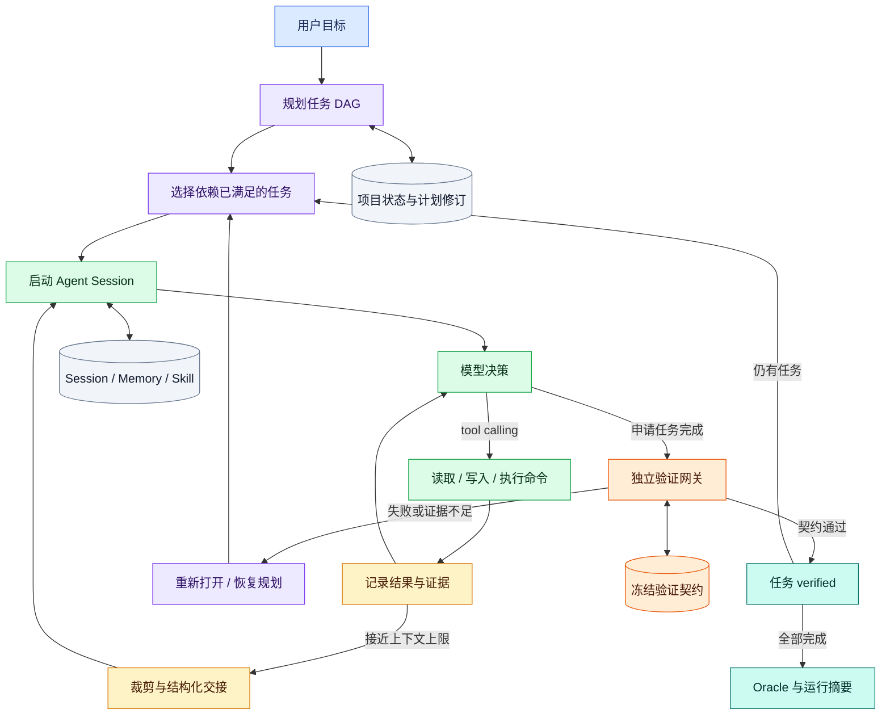

# coding-agent

一个面向真实代码仓库和长时编程任务的本地智能体运行时。

`coding-agent` 未使用现成的 Agent 框架。系统直接使用 OpenAI 兼容模型的原生 tool calling 接口，自行实现模型循环、工具执行、任务规划、状态持久化、上下文管理、经验沉淀和独立验证。

## 项目特点

### 1. 自主实现的模型—工具闭环

Agent 将用户目标、对话历史和工具定义发送给模型，解析原生工具调用，执行 `read_file`、`write_file` 或 `bash`，再把真实环境结果送回模型。协议错误、未知工具、非法参数和执行失败都会转换为结构化反馈，由模型在后续步骤中修正。

### 2. 面向长任务的持久化调度

项目模式把完整目标组织成带依赖关系的任务 DAG。调度器只释放依赖已经满足的任务，并持久化项目状态、任务状态、计划修订和 Session 轨迹。进程中断后可以从已有状态恢复，不需要重新完成已经验证的工作。

### 3. 可控的上下文生命周期

系统持续估算上下文预算，识别过期读取、被后续写入作废的测试结果和重复命令。在接近窗口上限时，它会裁剪低价值信息，并生成结构化交接记录，保留已确认的进展与对应证据、修改文件及内容哈希、已执行测试及其有效性，以及未解决错误、候选假设和下一步行动。新 Session 因而能够继续同一个项目任务，而不是依赖一段不可靠的自然语言摘要重新猜测现场。

### 4. 证据驱动的记忆与技能

每个 Session 都可以沉淀执行 episode。反思、memory 和 skill candidate 必须引用真实工具输出或验证结果，并经过置信度、作用域和生命周期规则过滤。检索到的知识会说明来源和适用条件；技能只作为操作建议，不会绕过正常工具权限自动执行代码。

### 5. 独立于 Agent 自述的完成验证

模型声称“完成”不等于项目完成。Agent 的完成申请还要经过独立验证网关。项目开始时会冻结验证契约，随后在隔离副本中执行公开测试和外部隐藏检查，并确认公开测试、任务文件和配置没有被篡改。系统也支持 Agent 生成问题复现测试并验证真实的 fail-to-pass 转换，最终生成独立 Oracle 结果和机器可读 summary；验证失败时，任务会被重新打开，而不是接受未经证明的完成声明。

## 运行流程


```mermaid
flowchart TD
    U[用户目标] --> P[规划任务 DAG]
    P --> S[选择依赖已满足的任务]
    S --> A[启动 Agent Session]
    A --> M[模型决策]
    M -->|tool calling| T[读取 / 写入 / 执行命令]
    T --> E[记录结果与证据]
    E --> M
    E -->|接近上下文上限| H[裁剪与结构化交接]
    H --> A
    M -->|申请任务完成| V[独立验证网关]
    V -->|失败或证据不足| R[重新打开 / 恢复规划]
    R --> S
    V -->|契约通过| D[任务 verified]
    D -->|仍有任务| S
    D -->|全部完成| O[Oracle 与运行摘要]

    P <--> DB[(项目状态与计划修订)]
    A <--> K[(Session / Memory / Skill)]
    V <--> C[(冻结验证契约)]

    classDef entry fill:#dbeafe,stroke:#2563eb,color:#172554;
    classDef planning fill:#ede9fe,stroke:#7c3aed,color:#2e1065;
    classDef execution fill:#dcfce7,stroke:#16a34a,color:#052e16;
    classDef evidence fill:#fef3c7,stroke:#d97706,color:#451a03;
    classDef verification fill:#ffedd5,stroke:#ea580c,color:#431407;
    classDef success fill:#ccfbf1,stroke:#0f766e,color:#042f2e;
    classDef storage fill:#f1f5f9,stroke:#64748b,color:#0f172a;

    class U entry;
    class P,S,R planning;
    class A,M,T execution;
    class E,H evidence;
    class V,C verification;
    class D,O success;
    class DB,K storage;
```

## 安装

要求 Python 3.11 及以上。普通功能可以在 Windows 运行；完整隔离验证推荐 Ubuntu 22.04+ 或 WSL2，并安装 Bubblewrap。

```bash
python -m venv .venv
source .venv/bin/activate
python -m pip install -e ".[dev]"
```

设置模型名称、OpenAI 兼容接口地址和 API 密钥。密钥只应通过环境变量或未入库配置提供。

```bash
export MODEL_NAME="your-tool-calling-model"
export OPENAI_BASE_URL="https://your-compatible-endpoint/v1"
export OPENAI_API_KEY="your-key"
```

## 基本使用

执行单个仓库任务：

```bash
coding-agent run \
  --config configs/baseline.yaml \
  --task "检查目标仓库，修复测试失败，并运行测试验证结果"
```

查看可用工具及参数协议：

```bash
coding-agent tools
```

项目模式还提供 `project start`、`project resume`、`project status`、`project tree` 和 `project metrics`，用于启动、恢复和检查持久化长任务。

## 综合演示案例

仓库保留一个正式综合案例：Agent 需要完成一个文件持久化工作流服务的执行、重试、依赖传播、幂等、审计、指标和 CLI 层。该案例使用五任务依赖 DAG，并启用多 Session、结构化上下文重置、生成测试、证据知识、自适应恢复、冻结公开/隐藏验证契约及独立 Oracle。

在 Ubuntu 或 WSL2 的仓库根目录运行：

```bash
PROJECT_ID="comprehensive-$(date -u +%Y%m%dT%H%M%SZ)" \
CASE_PROFILE=comprehensive \
bash scripts/run_long_horizon_real_api.sh
```

运行会先证明初始仓库存在预置缺陷，因此开头出现测试失败属于正常基线。随后脚本创建隔离工作区并启动 Agent。实际耗时取决于模型和接口速度，通常约 20 至 30 分钟。

如果运行被中断，可使用原项目 ID 恢复：

```bash
PROJECT_ID="your-project-id" \
CASE_PROFILE=comprehensive \
RESUME_PROJECT=1 \
MINIMUM_SECONDS=0 \
bash scripts/run_long_horizon_real_api.sh
```

一次成功运行应同时满足：

```text
project_status: verified
final_verification_status: verified
cli_exit_code: 0
integrity_passed: true
oracle_verified: true
violations: []
```

运行产物位于 `.runs/comprehensive_real_api/`。其中 `workspaces/<project-id>/` 保存隔离后的 Agent 工作区，`projects/<project-id>/` 保存项目状态、Session 记录和验证报告，`telemetry/` 保存模型交互、工具调用和证据记录，`results/<project-id>/oracle.json` 与 `summary.json` 分别提供独立结果校验和机器可读运行摘要。

## 测试与质量检查

```bash
pytest -q
ruff check .
ruff format --check .
python -m compileall -q src tests scripts
```

GitHub Actions 会在 Ubuntu 上安装 Bubblewrap，运行原生隔离测试、完整测试、覆盖率门槛、静态检查、格式检查、字节码编译和 diff 检查。
